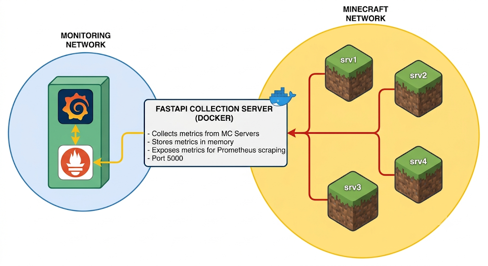
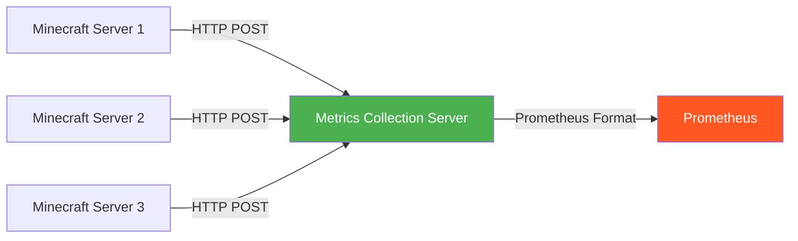

# Minecraft Metrics
### Roaring 20s Metrics Collection System

A lightweight metrics collection system for Minecraft servers that sends system and server metrics to a central collection server for monitoring with Prometheus.

## Overview

This project consists of two components:

- **Plugin**: A Paper/Spigot plugin that collects server metrics (TPS, MSPT, CPU, memory, players, chunks, uptime) and sends them via HTTP POST to a central server
- **Server**: A FastAPI-based collection server that receives metrics from multiple Minecraft servers and exposes them in Prometheus format for scraping

## Features

### Plugin Features
- **Performance Metrics**: TPS (1-minute average), MSPT (milliseconds per tick), CPU load percentage
- **Player Metrics**: Online players count, maximum allowed players
- **Memory Metrics**: Used, free, and total JVM heap memory in megabytes
- **World Metrics**: Number of loaded chunks across all worlds
- **System Metrics**: Server process uptime in seconds
- **Version Tracking**: Plugin version reporting
- **Configurable Intervals**: Adjustable send intervals (default: 10 seconds)
- **Failure Handling**: Automatic retry with escalating warnings after consecutive failures
- **Async Operation**: Non-blocking metric collection and sending
- **Authentication**: Bearer token authentication for secure communication

### Server Features
- **REST API**: Simple POST endpoint for metric collection
- **Prometheus Export**: Native Prometheus text format at `/metrics`
- **Multi-Server Support**: Handle metrics from multiple Minecraft servers simultaneously
- **In-Memory Storage**: Fast metric storage with automatic cleanup of stale data
- **Health Check**: `/health` endpoint for Docker health checks
- **Docker Support**: Ready-to-use Dockerfile and docker-compose configuration
- **Security**: Bearer token authentication for incoming metrics

## Architecture





## Installation

### Plugin Installation

1. **Build the plugin**:
   ```bash
   cd Plugin
   mvn clean package
   ```

2. **Install the plugin**:
   - Copy `target/MC-Metrics-1.x.x.jar` to your Minecraft server's `plugins/` directory
   - Restart the server or load the plugin

3. **Configure the plugin**:
   - Edit `plugins/MC-Metrics/config.yml`
   - Set your server ID, target URL, and authentication token

### Server Installation

#### Option 1: Docker (Recommended)

1. **Build and run with Docker Compose**:
   ```bash
   cd Server
   docker-compose up -d
   ```

2. **Configure environment variables** in `docker-compose.yml`:
   - `SECRET_TOKEN`: Your authentication token (must match plugin config)
   - `PORT`: Server port (default: 5000)
   - `STALE_SECONDS`: Time before metrics are considered stale (default: 60)
   - `CLEANUP_INTERVAL`: Cleanup interval in seconds (default: 30)

#### Option 2: Manual Installation

1. **Install dependencies**:
   ```bash
   cd Server
   pip install -r requirements.txt
   ```

2. **Set environment variables**:
   ```bash
   export SECRET_TOKEN="your-secret-token"
   export PORT="5000"
   export STALE_SECONDS="60"
   export CLEANUP_INTERVAL="30"
   ```

3. **Run the server**:
   ```bash
   python main.py
   ```

## Configuration

### Plugin Configuration (`config.yml`)

```yaml
# ServerMetrics - Configuration
target_url: "http://127.0.0.1:5000/push"  # URL of the collection server
server_id: "servername"                          # Unique identifier for this server
send_interval_seconds: 10                  # How often to send metrics (in seconds)
auth_token: "CHANGE_THIS_TOKEN"            # Bearer token for authentication
connect_timeout_seconds: 3                 # HTTP connection timeout
request_timeout_seconds: 5                 # HTTP request timeout
debug_logging: false                       # Enable debug logging
```

### Server Configuration (Environment Variables)

- `SECRET_TOKEN`: Authentication token for incoming metrics (required)
- `PORT`: Server port (default: 5000)
- `STALE_SECONDS`: Seconds before metrics are considered stale (default: 60)
- `CLEANUP_INTERVAL`: Cleanup interval in seconds (default: 30)


## Security Considerations

- **Change default tokens**: Replace `CHANGE_THIS_TOKEN` with strong, unique tokens
- **Firewall rules**: Restrict access to the metrics server port
- **Token rotation**: Regularly rotate authentication tokens
- **Network isolation**: Run the metrics server in a secure network segment

We at Roaring 20s recommend, using a internal network for the metrics server, which the Plugins & Prometheus can access.

## Docker Configuration

The server includes a Dockerfile for containerized deployment:

- **Base image**: `python:3.12-slim`
- **Memory limit**: 128MB (configurable in docker-compose.yml)
- **CPU limit**: 0.5 cores (configurable in docker-compose.yml)
- **Health check**: Automatic health check every 30 seconds
- **User**: Runs as non-root user `appuser` for security

## Troubleshooting

### Plugin Issues

- **Metrics not sending**: Check `target_url` and `auth_token` in config.yml
- **Connection timeouts**: Increase `connect_timeout_seconds` and `request_timeout_seconds`
- **Enable debug logging**: Set `debug_logging: true` in config.yml

### Server Issues

- **No metrics received**: Check that `SECRET_TOKEN` matches plugin's `auth_token`
- **Stale metrics**: Adjust `STALE_SECONDS` environment variable
- **Port conflicts**: Change `PORT` environment variable

## Development

### Plugin Development

- **Java version**: 17
- **Build tool**: Maven
- **API**: Paper/Spigot 1.20.4

### Server Development

- **Python version**: 3.12
- **Framework**: FastAPI
- **ASGI server**: Uvicorn

## Metrics Reference

| Metric Name | Type | Description |
|-------------|------|-------------|
| `mc_tps` | gauge | Current TPS (1-minute average, capped at 20.0) |
| `mc_mspt` | gauge | Average tick duration in milliseconds |
| `mc_cpu_load_percent` | gauge | JVM process CPU load in percent (0.0 - 100.0) |
| `mc_online_players` | gauge | Online players count |
| `mc_max_players` | gauge | Maximum allowed players |
| `mc_memory_used_megabytes` | gauge | Used JVM heap memory in megabytes |
| `mc_memory_free_megabytes` | gauge | Free JVM heap memory in megabytes |
| `mc_memory_total_megabytes` | gauge | Total allocated JVM heap memory in megabytes |
| `mc_chunks_loaded` | gauge | Number of loaded chunks across all worlds |
| `mc_uptime_seconds` | gauge | Server process uptime in seconds |
| `mc_plugin_version` | gauge | Minecraft plugin version parsed as float |
| `mc_bridge_servers_reporting` | gauge | Number of servers currently reporting fresh data |


## Contributing

Contributions are welcome! Please feel free to submit a Pull Request.

## Support

For issues and questions, please open an issue on the GitHub repository.
